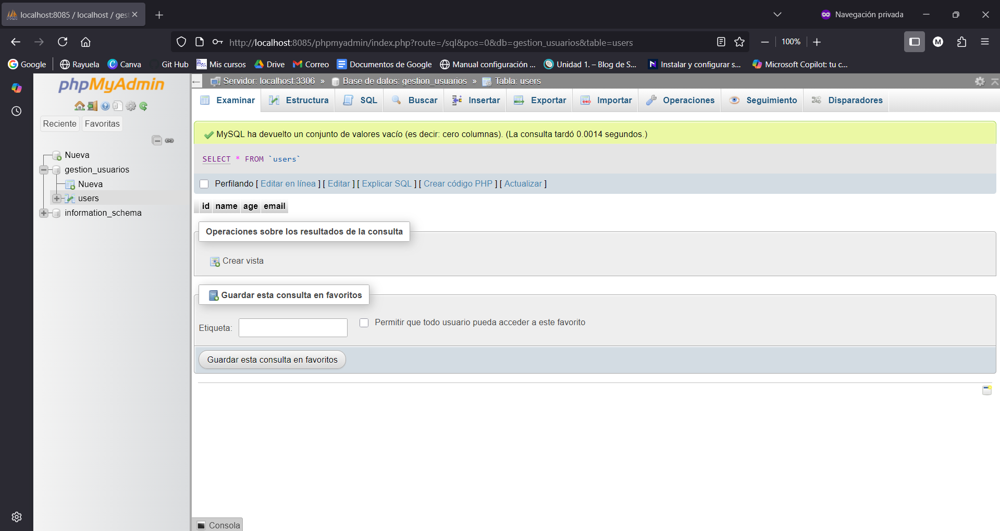

# Pila-Lamp-2N
## Manuel Soltero Díaz
### ASIR2 - IAW

Este proyecto se basa usando Vagrant con Debian 12 una infraestructura de dos máquinas conectadas entre sí que corren una un apache y la otra un servidor de base de datos, en este caso, MariaDB usado la herramienta de PHP para poder ver la app a través del navegador.

Archivos usados: 
- Vagrantfile.
- Scripts de aprovisionamiento.

## Vagrantfile
```
# -*- mode: ruby -*-
# vi: set ft=ruby :

# All Vagrant configuration is done below. The "2" in Vagrant.configure
# configures the configuration version (we support older styles for
# backwards compatibility). Please don't change it unless you know what
# you're doing.
Vagrant.configure("2") do |config|
  # The most common configuration options are documented and commented below.
  # For a complete reference, please see the online documentation at
  # https://docs.vagrantup.com.

  # Every Vagrant development environment requires a box. You can search for
  # boxes at https://vagrantcloud.com/search.


  # Disable automatic box update checking. If you disable this, then
  # boxes will only be checked for updates when the user runs
  # `vagrant box outdated`. This is not recommended.
  # config.vm.box_check_update = false

  # Create a forwarded port mapping which allows access to a specific port
  # within the machine from a port on the host machine. In the example below,
  # accessing "localhost:8080" will access port 80 on the guest machine.
  # NOTE: This will enable public access to the opened port

  # Creación de la máquina Apache llamada ManuelSoltApache
    config.vm.define "ManuelSoltApache" do |apache|
    apache.vm.box = "debian/bookworm64"
    apache.vm.hostname = "ManuelSoltApache"
    apache.vm.network "forwarded_port", guest: 80, host: 8082
    apache.vm.network "private_network", ip: "192.168.33.10"
    apache.vm.provision "shell", path: "Apache.sh"
  end
  # Creación de la máquina que implementa la Base de Datos llamada ManuelSoltMySql
    config.vm.define "ManuelSoltMySql" do |mysql|
    mysql.vm.box = "debian/bookworm64"
    mysql.vm.hostname = "ManuelSoltMysql"
    mysql.vm.network "private_network", ip: "192.168.33.11"
    mysql.vm.provision "shell", path: "Mysql.sh"
    mysql.vm.network "forwarded_port", guest: 3306, host: 8084
    mysql.vm.network "forwarded_port", guest: 80, host: 8085
  end


  # Create a forwarded port mapping which allows access to a specific port
  # within the machine from a port on the host machine and only allow access
  # via 127.0.0.1 to disable public access
  # config.vm.network "forwarded_port", guest: 80, host: 8080, host_ip: "127.0.0.1"

  # Create a private network, which allows host-only access to the machine
  # using a specific IP.
  # config.vm.network "private_network", ip: "192.168.33.10"

  # Create a public network, which generally matched to bridged network.
  # Bridged networks make the machine appear as another physical device on
  # your network.
  # config.vm.network "public_network"

  # Share an additional folder to the guest VM. The first argument is
  # the path on the host to the actual folder. The second argument is
  # the path on the guest to mount the folder. And the optional third
  # argument is a set of non-required options.
  # config.vm.synced_folder "../data", "/vagrant_data"

  # Disable the default share of the current code directory. Doing this
  # provides improved isolation between the vagrant box and your host
  # by making sure your Vagrantfile isn't accessible to the vagrant box.
  # If you use this you may want to enable additional shared subfolders as
  # shown above.
  # config.vm.synced_folder ".", "/vagrant", disabled: true

  # Provider-specific configuration so you can fine-tune various
  # backing providers for Vagrant. These expose provider-specific options.
  # Example for VirtualBox:
  #
  # config.vm.provider "virtualbox" do |vb|
  #   # Display the VirtualBox GUI when booting the machine
  #   vb.gui = true
  #
  #   # Customize the amount of memory on the VM:
  #   vb.memory = "1024"
  # end
  #
  # View the documentation for the provider you are using for more
  # information on available options.

  # Enable provisioning with a shell script. Additional provisioners such as
  # Ansible, Chef, Docker, Puppet and Salt are also available. Please see the
  # documentation for more information about their specific syntax and use.
  # config.vm.provision "shell", inline: <<-SHELL
  #   apt-get update
  #   apt-get install -y apache2
  # SHELL
end

```
## Script Apache - ManuelSoltApache
```

#!/bin/bash
# Aprovisionamiento del servidor Apache

set -e
# Actualizando paquetes e instalando Apache y PHP
echo " Actualizando paquetes e instalando Apache y PHP..."
sudo apt update
sudo apt install apache2 php -y
# Clonando aplicación desde GitHub
echo " Clonando aplicación desde GitHub..."
sudo apt install -y git
git clone https://github.com/josejuansanchez/iaw-practica-lamp.git
sudo  mv iaw-practica-lamp/src/* /var/www/html/
chown -R www-data:www-data /var/www/html/
sudo  systemctl restart apache2
# Configurando conexión a la base de datos
echo " Configurando conexión a la base de datos..."
cat <<EOF > /var/www/html/config.php
<?php
define('DB_HOST', '192.168.33.11');
define('DB_NAME', 'gestion_usuarios');
define('DB_USER', 'manuelsolt');
define('DB_PASSWORD', 'abcd');

\$mysqli = mysqli_connect(DB_HOST, DB_USER, DB_PASSWORD, DB_NAME);
?>
EOF
# Reiniciando Apache
echo " Reiniciando Apache..."
sudo systemctl restart apache2

echo " Servidor Apache aprovisionado y funcionando correctamente."

```

## Script de MySql - ManuelSoltMySql
```
#!/bin/bash
# Aprovisionamiento del servidor MySQL + PHPMyAdmin

set -e
# Variable con la contraseña de phpmyadmin
PHPMYADMIN_APP_PASSWORD="abcd"

# Actualizando paquetes e instalando MariaDB, Apache y PHP
echo " Actualizando paquetes e instalando MariaDB, Apache y PHP..."
apt update
apt install
apt install -y git mariadb-server apache2 php libapache2-mod-php php-mysql
# Insalando PHPMyAdmin
echo " Instalando PHPMyAdmin..."
echo "phpmyadmin phpmyadmin/reconfigure-webserver multiselect apache2" | debconf-set-selections
echo "phpmyadmin phpmyadmin/dbconfig-install boolean true" | debconf-set-selections
echo "phpmyadmin phpmyadmin/mysql/app-pass password $PHPMYADMIN_APP_PASSWORD" | debconf-set-selections
echo "phpmyadmin phpmyadmin/app-password-confirm password $PHPMYADMIN_APP_PASSWORD" | debconf-set-selections
apt install -y phpmyadmin php-mbstring php-zip php-gd php-json php-curl
# Configurando MariaDB
echo " Configurando MariaDB..."
systemctl enable mariadb
systemctl start mariadb
# Creando base de datos y usuario
echo " Creando base de datos y usuario..."
mysql -u root <<FIN
CREATE DATABASE IF NOT EXISTS gestion_usuarios;
CREATE USER IF NOT EXISTS 'manuelsolt'@'%' IDENTIFIED BY 'abcd';
GRANT ALL PRIVILEGES ON gestion_usuarios.* TO 'manuelsolt'@'%';
FLUSH PRIVILEGES;
FIN
# Clonando repositorio para importar estructura de la base de datos
echo " Clonando repositorio para importar estructura de la base de datos..."
git clone https://github.com/josejuansanchez/iaw-practica-lamp.git

# Importando estructura desde database.sql en la base de datos gestion_usuarios
echo " Importando estructura desde database.sql en la base de datos gestion_usuarios..."
mysql -u root gestion_usuarios <<EOF
USE gestion_usuarios;
$(cat iaw-practica-lamp/db/database.sql)
EOF
#  Reiniciando Apache
echo " Reiniciando Apache..."
systemctl restart apache2
# Quitar puerta de enlace para que no tenga acceso a internet
ip route del default
echo " Servidor MySQL y PHPMyAdmin aprovisionado correctamente."
```

## Capturas del resultado

### Máquina Apache - ManuelSoltApache

### Máquina MySql - ManuelSoltMysql

## Video de PHPMYADMIN en la carpeta capturas

